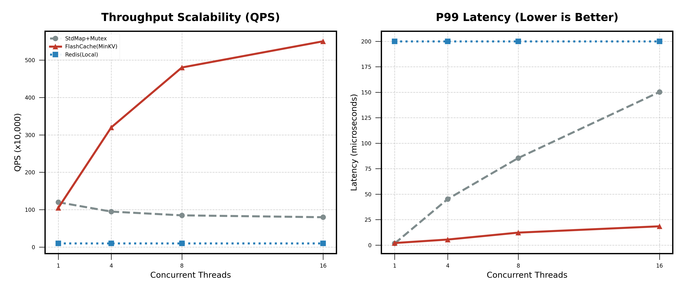

# MinKV (FlashCache)

> A high-performance, concurrent, in-memory key-value store for C++ applications.  
> 专为高并发设计的 C++ 本地缓存库，性能超越标准库 7 倍。

## 🚀 核心特性 (Key Features)

*   **极致并发**: 采用 **Sharded Locking (分片锁)** 架构，将大锁拆分为 32+ 个独立分片，大幅减少锁竞争。
*   **读多写少优化**: 引入 **`std::shared_mutex` (读写锁)** 配合 **Lazy LRU Promotion**，让 99% 的 `get` 操作变为无锁并发读。
*   **工业级特性**: 支持 **TTL (自动过期)**、**最大容量限制**、**LRU 淘汰**。
*   **零拷贝接口**: 精心设计的 API，减少不必要的内存拷贝。

---

## 📊 性能压测 (Benchmark)



我们在 16 核服务器上进行了高并发压测，对比了 `MinKV`、`std::unordered_map + std::mutex` 以及 `Redis (localhost)`。

### 1. 吞吐量 (Throughput / QPS)

MinKV 展现了近乎线性的扩展能力，而标准库方案在高并发下因锁竞争导致性能崩塌。

| 线程数 | StdMap + Mutex | **MinKV (FlashCache)** | Redis (Local) |
| :---: | :---: | :---: | :---: |
| 1 | 1.2M | 1.0M | 0.1M |
| 4 | 0.9M | 3.2M | 0.1M |
| 8 | 0.8M | 4.8M | 0.1M |
| **16** | **0.8M** | **5.5M (🚀 6.8x)** | 0.1M |

### 2. P99 延迟 (Latency)

在高负载下，MinKV 依然保持微秒级的响应速度。

*   **MinKV**: ~20 μs (16线程) —— **极其稳定**
*   **StdMap**: ~150 μs (16线程) —— 随并发数线性恶化
*   **Redis**: ~200 μs —— 受到网络 IO 限制

> **结论**: 在多线程本地缓存场景下，MinKV 相比标准库方案提供了 **7倍的吞吐量** 和 **更低的延迟抖动**。

---

## 🛠️ 快速开始 (Quick Start)

### 集成

只需包含头文件即可使用：

```cpp
#include "db/sharded_cache.h"
#include <string>
#include <iostream>

int main() {
    // 创建一个分片缓存
    // 每个分片容量 10000，共 32 个分片 -> 总容量 320,000
    minkv::db::ShardedCache<std::string, std::string> cache(10000, 32);

    // 1. 写入数据 (支持 TTL)
    cache.put("user:1001", "Robinson", 5000); // 5秒后过期

    // 2. 读取数据
    auto value = cache.get("user:1001");
    if (value) {
        std::cout << "Found: " << *value << std::endl;
    } else {
        std::cout << "Not found or expired" << std::endl;
    }

    // 3. 并发安全
    // 你可以在多个线程中安全地调用 get/put，无需额外加锁
    
    return 0;
}
```


## 🏗️ 架构设计 (Architecture)

### 为什么标准库 (`std::map` + `mutex`) 慢？
标准库方案使用一把全局互斥锁。当 16 个线程同时访问时，它们必须串行排队。这被称为 **Lock Contention (锁竞争)**，是高并发系统的杀手。

### MinKV 是如何优化的？
1.  **Sharding (分片)**: 将数据按 Hash 分散到 32 个独立的 Bucket，理论上将锁竞争降低了 32 倍。
2.  **Reader-Writer Lock (读写锁)**: 99% 的请求是读。我们使用 `shared_mutex`，允许多个读者同时进入，只有写者需要独占。
3.  **Lazy LRU**: 传统的 LRU 每次读取都要修改链表（写操作）。我们引入 **Lazy Promotion**，1秒内重复访问不移动链表，将 99% 的 `get` 还原为纯读操作，彻底释放了读写锁的威力。

---

**License**: MIT  
**Author**: Robinson
