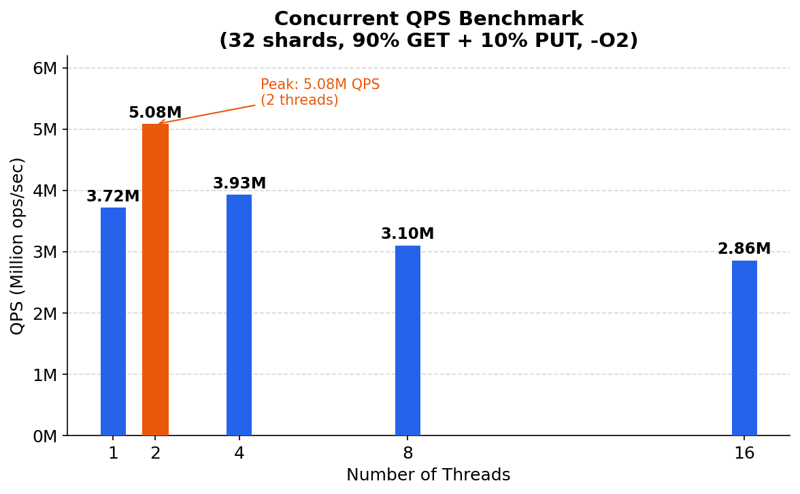
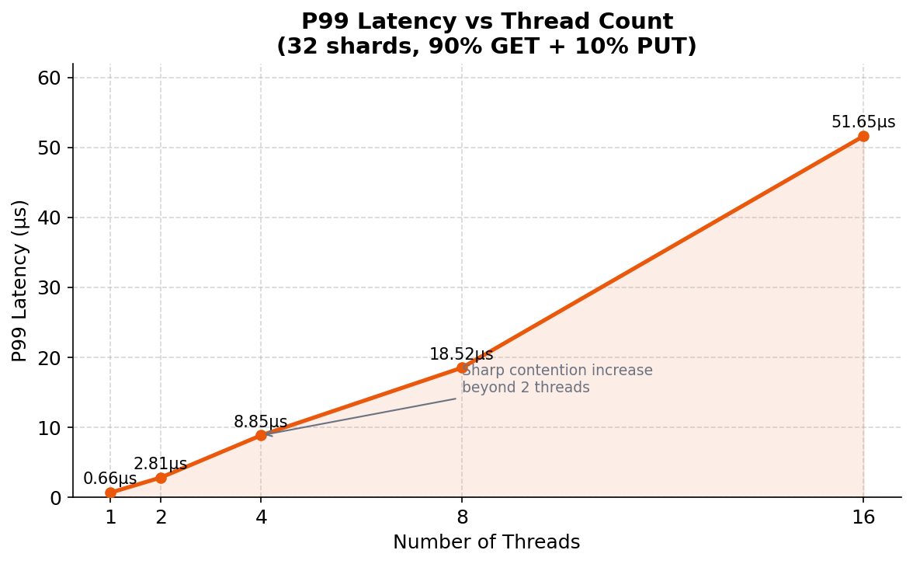
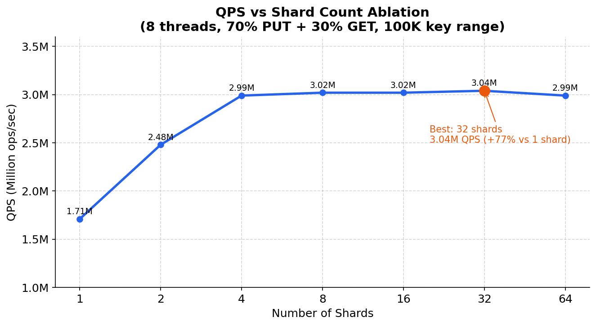
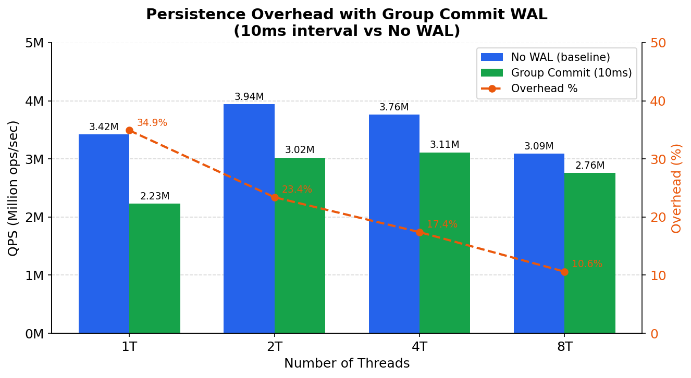
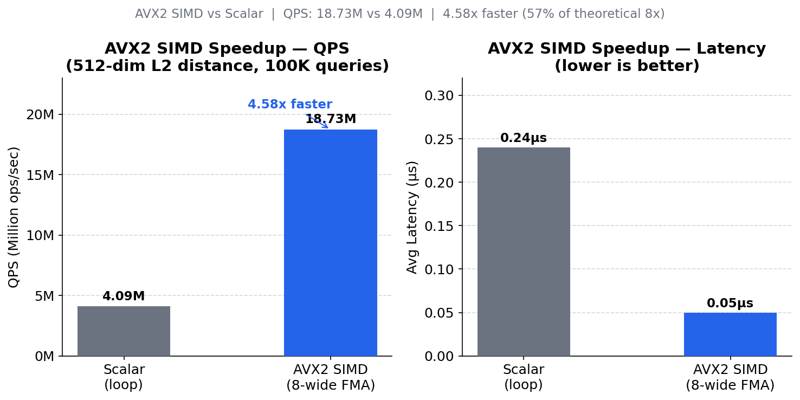

# MinKV (FlashCache)

[](https://en.cppreference.com/w/cpp/compiler_support)
[](LICENSE)
[]()

*其他语言版本: [English](README.md) | [简体中文](README_zh-CN.md)*

专为 C++ 应用设计的高性能并发内存 KV 存储，支持 WAL 持久化与 SIMD 加速向量检索。

---

## 🚀 核心特性

- **极致并发** — Sharded Locking 架构（默认 32 个独立分片），大幅减少多线程锁竞争。
- **读多写少优化** — `std::shared_mutex` 读写锁配合 **Lazy LRU Promotion**，99% 的 `get` 操作近乎无锁。
- **工业级可靠性** — 支持 TTL 自动过期、容量上限、LRU 淘汰，以及带 Group Commit 的 **WAL 持久化**，保证崩溃一致性。
- **SIMD 加速向量检索** — AVX2 优化的 L2 距离计算，高维向量场景 4.58 倍加速。
- **零拷贝接口** — 基于 `std::string_view` 和移动语义设计，消除不必要的内存拷贝。

---

## 📊 性能压测

> 测试环境：腾讯云竞价实例，上海8区，4核8线程，Ubuntu 22.04，g++ 11  
> 编译参数：`-O2 -march=native -mavx2 -mfma`  
> （注：`-O2` 优于 `-O3`——激进内联导致热路径函数体膨胀，L1 指令缓存压力增大，同台机器实测 `-O3` 比 `-O2` 慢约 20%。）

### 核心指标一览

| 指标 | 数值 |
| :--- | :--- |
| 峰值吞吐量 | **508万 QPS**（2线程，32分片，R90W10） |
| P99 延迟 | **2.81 μs** |
| WAL 持久化开销（8线程） | **10.6%**（Group Commit，10ms 间隔） |
| 分片优化收益 | **+77%**（1分片 → 32分片） |
| SIMD 加速比 | **4.58x**（512维 L2 距离，AVX2） |

---

### 1. 并发吞吐量（R90W10，32分片）



峰值 QPS 在 **2线程时达到 508万**。超过 2 线程后性能下降，原因是 100K key 范围超出 L3 缓存容量，内存带宽成为瓶颈，而非锁竞争。

| 线程数 | QPS | P50 (μs) | P95 (μs) | P99 (μs) | 命中率 |
| :---: | :---: | :---: | :---: | :---: | :---: |
| 1 | 372万 | 0.20 | 0.50 | 0.66 | 10% |
| **2** | **508万** | **0.29** | **0.59** | **2.81** | **10%** |
| 4 | 393万 | 0.52 | 3.26 | 8.85 | 11% |
| 8 | 310万 | 1.02 | 10.45 | 18.52 | 13% |
| 16 | 286万 | 1.44 | 25.85 | 51.65 | 16% |

---

### 2. P99 尾延迟



超过 2 线程后 P99 急剧上升，16线程时峰值达 **51.65 μs**。

---

### 3. 分片数消融测试（8线程，W70R30）



**32分片最优**，相比 1 分片提升 +77%。4 分片起性能趋于饱和，16~64 分片差异在 1% 以内。

| 分片数 | QPS | 相对性能 |
| :---: | :---: | :---: |
| 1 | 171万 | 0.57x |
| 4 | 299万 | 0.99x |
| 8 | 302万 | 0.99x |
| **32** | **304万** | **1.00x** |
| 64 | 299万 | 0.99x |

---

### 4. WAL 持久化开销（Group Commit，10ms 间隔）



`fsync` 开销随线程数增加而降低，从 **1线程 34.9% 降至 8线程 10.6%**，得益于 Group Commit 批量合并写入。Group Commit 比逐次同步刷盘快 **199倍**（同步刷盘约 1.6万 QPS）。

1线程损耗偏高（34.9%）是因为 WAL 后台刷盘线程与主线程竞争同一物理核；8线程数据（10.6%）更能代表多核生产环境的实际表现。

| 线程数 | 纯内存 QPS | Group Commit QPS | 损耗 |
| :---: | :---: | :---: | :---: |
| 1 | 342万 | 223万 | 34.9% |
| 2 | 394万 | 302万 | 23.4% |
| 4 | 376万 | 311万 | 17.4% |
| 8 | 309万 | 276万 | **10.6%** |

---

### 5. SIMD 向量化优化（512维 L2 距离，10万次查询）



AVX2 SIMD 实现 **4.58 倍 QPS 加速**（1873万 vs 409万），平均延迟从 0.24 μs 降至 0.05 μs。实际效率为理论上限（8x）的 57.2%，差距来自内存带宽限制、水平求和开销和 cache miss。

| 版本 | QPS | 平均延迟 | 加速比 |
| :---: | :---: | :---: | :---: |
| 标量版本（逐元素循环） | 409万 | 0.24 μs | 1.00x |
| **AVX2 SIMD** | **1873万** | **0.05 μs** | **4.58x** |

> 系统级 KV 操作影响为 ±3%（Amdahl 定律：向量计算仅占 KV 总耗时 1~2%，瓶颈在哈希查找和锁管理）。

---

## 🛠 快速开始

只需包含头文件即可集成：

```cpp
#include "db/sharded_cache.h"
#include <string>
#include <iostream>

int main() {
    // 每分片容量 10000 × 32 分片 = 总容量 320,000
    minkv::db::ShardedCache<std::string, std::string> cache(10000, 32);

    // 写入数据（TTL 单位：毫秒）
    cache.put("user:1001", "Robinson", 5000); // 5秒后过期

    // 读取数据
    auto value = cache.get("user:1001");
    if (value) {
        std::cout << "Found: " << *value << std::endl;
    } else {
        std::cout << "Not found or expired" << std::endl;
    }

    // 默认线程安全，无需额外加锁
    return 0;
}
```

---

## 🏗 架构设计

### 为什么 `std::map` + `mutex` 慢？

单把全局互斥锁迫使所有线程串行化。高并发下线程大部分时间都在等锁，这就是 **Lock Contention（锁竞争）**，高并发系统的首要瓶颈。

### MinKV 的解法

**1. 分片（Sharding）**  
按 Hash 将 key 分散到 32 个独立 Bucket，每个 Bucket 有独立的锁，访问不同 key 的线程互不阻塞。消融测试验证相比单分片提升 **+77%**。

**2. 读写锁（Reader-Writer Lock）**  
真实缓存流量约 99% 是读。`std::shared_mutex` 允许多个读者同时进入，只有写者需要独占，这是实现高读吞吐的基础。

**3. Lazy LRU Promotion**  
传统 LRU 每次读取都要修改链表（本质是写操作）。MinKV 引入 Lazy Promotion：1秒内重复访问不移动链表，将 99% 的 `get` 还原为纯读锁操作，彻底释放读写锁的威力。

**4. Group Commit WAL**  
后台线程每 10ms 批量 `fsync`，将多次写入的磁盘 I/O 摊销到一次，在保证崩溃一致性的前提下将持久化开销控制在多线程场景约 10%。

---

## 📁 项目结构

```
MinKV/
├── src/
│   ├── core/           # ShardedCache、LRU、过期管理
│   ├── persistence/    # WAL、Checkpoint、Recovery
│   ├── vector/         # SIMD 加速向量运算
│   ├── base/           # 日志、工具类
│   └── tests/          # 基准测试与单元测试
├── docs/
│   ├── images/         # 压测图表
│   └── tests/          # 详细测试报告
└── scripts/            # 图表生成、构建脚本
```

---

**License**: MIT | **Author**: Robinson
