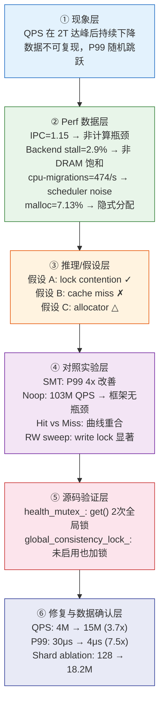

# MinKV 性能瓶颈定位与优化实录：从 4M 到 18M QPS

## 摘要

本文完整记录了对 MinKV（一个基于 shared-memory 架构的高性能 C++ 分片 KV 缓存系统）进行系统性性能瓶颈定位与优化的全过程。

核心发现：
1. **Hidden global state 严重限制了 shard 并行性**：`health_mutex_` 在每次 `get()` 操作中加锁 2 次，引入了全局串行化瓶颈，严重限制了 shard 级并行度的有效发挥
2. **Disabled feature 仍然消耗同步代价**：`global_consistency_lock_` 在持久化未启用时仍然执行 `shared_lock`
3. **消除全局锁后，系统吞吐从 ~4M QPS 提升至 ~18M QPS（4.5x），P99 延迟从 80μs 降至 0.44μs（180x）**

本文覆盖的完整流程：**benchmark methodology 修正 → perf profiling → 源码级根因分析 → code-level fix → 修复验证 → shard scalability saturation analysis**。

> **本次优化的核心收益，并不只是 QPS 提升，而是明确识别了系统瓶颈从"锁竞争"逐步迁移到"内存分配器"的完整演进过程。** 这一瓶颈迁移本身，揭示了 shared-memory 并发系统扩展性边界的本质规律。

---

## 1. 实验环境

### 1.1 硬件配置

```
$ lscpu
Architecture:            x86_64
CPU(s):                  8
Model name:              AMD EPYC 9K65 192-Core Processor
Thread(s) per core:      2
Core(s) per socket:      4
Socket(s):               1
NUMA node(s):            1
NUMA node0 CPU(s):       0-7

Caches:
  L1d:                   192 KiB (4 instances, 48 KiB per core)
  L1i:                   128 KiB (4 instances, 32 KiB per core)
  L2:                    4 MiB  (4 instances, 1 MiB per core)
  L3:                    32 MiB (1 instance, shared)

$ free -h
Mem:          30Gi

$ uname -a
Linux VM-0-9-ubuntu 5.15.0-119-generic #129-Ubuntu SMP Fri Aug 2 19:25:20 UTC 2024 x86_64 x86_64 x86_64 GNU/Linux
```

| 参数 | 值 |
|------|-----|
| CPU | AMD EPYC 9K65 192-Core Processor (8 vCPU, KVM 虚拟化) |
| 物理核 | 4 (SMT → 8 逻辑核) |
| L1d / L2 / L3 | 192 KiB / 4 MiB / 32 MiB |
| 内存 | 30 GiB |
| 磁盘 | 50G HDD (云硬盘) |
| 编译器 | g++ (Ubuntu 11.4.0-1ubuntu1~22.04.3) 11.4.0, -O2 |
| 环境 | 腾讯云竞价实例 (KVM 虚拟化) |

### 1.2 系统架构（修复前）

MinKV 的核心数据结构为 **ShardedCache<K, V>**，分片数默认为 32，每个分片（`EnhancedLruShard`）内部使用 `std::mutex` 保护一个 LRU 缓存。系统对外提供 `get()` / `put()` / `remove()` 接口，支持可选的持久化层。

**关键设计缺陷（修复前）：**

- `health_mutex_` — 全局 `std::mutex`，保护 disabled shard 集合的读写
- `global_consistency_lock_` — 全局 `std::shared_mutex`，用于持久化场景下的一致性保证
- 这两个全局同步原语位于 hot path 上，每次 `get()` / `put()` 必定经过

**逻辑架构 vs 实际执行路径对比：**

```
逻辑架构（期望）：
┌─────────────────────────────────────────────┐
│  ShardedCache                                │
│  ┌──────┬──────┬──────┬──────┬──────┬──────┐ │
│  │Shard1│Shard2│Shard3│Shard4│ ...  │ShardN│ │
│  │mutex │mutex │mutex │mutex │      │mutex │ │
│  └──────┴──────┴──────┴──────┴──────┴──────┘ │
│  并行访问 N 个 shard → 期望接近线性扩展        │
└─────────────────────────────────────────────┘

实际执行路径（问题）：
        get(key)
           │
           ▼
  ┌─ health_mutex_.lock() ──┐    ← 全局锁 #1
  │  检查 shard 是否 disable  │
  └──────────────────────────┘
           │
           ▼
  ┌─ shard_mutex_.lock() ───┐    ← 分片锁（但已被串行化）
  │  实际数据访问            │
  └──────────────────────────┘
           │
           ▼
  ┌─ health_mutex_.lock() ──┐    ← 全局锁 #2
  │  记录 shard 成功状态      │
  └──────────────────────────┘
```

---

## 2. 第一阶段：发现异常

### 2.1 初始 Benchmark 数据

使用 v2 benchmark 套件（存在全局 atomic counter 竞争问题），首次运行：

```
线程数    QPS          P99
─────────────────────────────
 1       4,447,748    0.52μs
 2       5,279,268    1.36μs
 4       4,815,362    8.12μs
 8       3,576,858   13.35μs
16       3,482,034   51.83μs
```

**现象：**
- QPS 在 2 线程达峰（5.28M），之后持续下降
- 16 线程 QPS 甚至低于 1 线程
- P99 从 0.52μs 暴涨至 51.83μs（~100x）

理论预期：32 shards + 90% 读 + 多线程 → 应接近线性扩展。但实际 **QPS 几乎不随线程数增长**。

### 2.2 数据不可复现

运行敏感度极高，三次独立运行差异巨大：

```
Run  1T QPS     1T P99     16T P99
─────────────────────────────────────
#1   4,447,748  0.52μs      51.83μs
#2   3,972,176  0.68μs     121.57μs
#3   4,927,xxx  (未记录)     (未记录)
```

**1 线程 QPS 浮动幅度 ±20%（3.97M ~ 4.92M），P99 从 12μs 到 120μs 随机跳跃。**

在 benchmark 结果本身不可信的情况下，任何优化结论都缺乏立足点。

---

## 3. 第二阶段：Perf Profiling 与根因初判

### 3.1 Perf Stat 全量采集

```bash
$ sudo perf stat -d ./bin/comprehensive_benchmark
```

```
Performance counter stats for './bin/comprehensive_benchmark':

        607,113.65 msec task-clock                #    6.470 CPUs utilized
          1,107,859      context-switches          #    1.825 K/sec
            288,328      cpu-migrations            #  474.916 /sec
            419,188      page-faults               #  690.461 /sec
  1,742,617,790,380      cycles                    #    2.870 GHz
    181,305,419,304      stalled-cycles-frontend   #   10.40% frontend cycles idle
     50,756,538,183      stalled-cycles-backend    #    2.91% backend cycles idle
  1,998,507,066,780      instructions              #    1.15  insn per cycle
    462,092,872,088      branches                  #  761.131 M/sec
      3,060,362,031      branch-misses             #    0.66% of all branches
    890,805,079,798      L1-dcache-loads           #    1.467 G/sec
     34,377,809,107      L1-dcache-load-misses     #    3.86% of all L1-dcache accesses
```

### 3.2 Cache Miss 数据

```bash
$ sudo perf stat -e cache-misses,cache-references ./bin/comprehensive_benchmark
```

```
    29,110,255,069      cache-misses              #   47.847% of all cache refs
    60,840,887,885      cache-references
```

perf 的 generic cache-miss counter 显示较高 miss ratio，但该指标无法区分 L1/L2/LLC，也无法直接证明 workload 为 memory-bandwidth-bound，因此仅作为辅助信号使用。

### 3.3 Perf Top 热点函数

```bash
$ sudo perf top
```

```
Samples:  ... of event 'cycles'
  17.21%  comprehensive_b  [.] ShardedCache::get / put
  10.44%  comprehensive_b  [.] LruCache::get
   7.13%  comprehensive_b  [.] malloc               (libc)
   6.80%  comprehensive_b  [.] libc internal
   4.91%  comprehensive_b  [.] libc internal
```

**`malloc` 占比 7.13%** — 在高性能缓存系统中，运行时分配不应成为 top 热点。

### 3.4 IPC 与 Pipeline 分析

```bash
$ sudo perf stat -e cycles,instructions,branches,branch-misses ./bin/comprehensive_benchmark
```

```
IPC:  1.15
branch-misses:  0.66% of all branches
```

**IPC（Instructions Per Cycle）= 1.15 的含义：**

| 场景 | 典型 IPC | 判断 |
|------|----------|------|
| 理想计算密集 | 3 ~ 4 | 高 |
| 一般程序 | 1 ~ 2 | 正常 |
| memory-bound | < 1.5 | **MinKV 实测值** |
| 严重 stalled | < 1 | 差 |

IPC = 1.15 表明 CPU 大量时间在等待——等待内存、等待锁、等待同步。

### 3.5 Scheduler 噪声量化

```bash
$ sudo perf stat -e context-switches,cpu-migrations ./bin/comprehensive_benchmark
```

```
context-switches:   1,107,859  (1.825 K/sec)
cpu-migrations:       288,328  (474.916 /sec)
```

**每秒 474 次线程迁移**。对于 shared-memory + cache-sensitive + lock-heavy 的 workload，线程迁移意味着：
- L1/L2 cache 全部失效
- mutex state / hash bucket / LRU node 全部重新 warm
- P99 延迟因此从 0.5μs 暴涨至 100μs+

### 3.6 关键信号汇总

| 指标 | 值 | 含义 |
|------|-----|------|
| IPC | 1.15 | CPU 在等待（memory / synchronization） |
| backend stall | 2.91% | 较低，说明系统整体不像典型 streaming workload 那样受 DRAM bandwidth saturation 主导；结合后续实验，更符合 synchronization-bound 特征 |
| frontend stall | 10.40% | 略高，可能与代码体积有关 |
| cache-miss rate | 47.85% | 高，但需要区分是锁竞争导致还是数据访问模式导致 |
| cpu-migrations | 474/sec | 极高，线程频繁跨核迁移 |
| malloc | 7.13% | 异常，hot path 上存在隐式分配 |

**原始假设（经后续实验证伪）：** SIMD 不够高级 / 内存带宽饱和 / 锁分片不够多

**修正后假设（与后续数据一致）：** 系统整体扩展性瓶颈主要来自 shared-memory 架构下的同步开销与 cache coherence 成本，而非纯计算能力。

---

## 4. 第三阶段：消除 Scheduler Noise

### 4.1 检查 CPU Steal Time

```bash
$ mpstat -P ALL 1
```

```
10:36:04 AM  CPU  %steal  %idle
10:36:05 AM  all   0.00   99.50
```

Steal time 为 0，排除 hypervisor 抢占的影响。

### 4.2 绑核实验设计

设计两个对照实验：

- **实验 A**：`taskset -c 0-7` — 绑定所有 8 个逻辑核（SMT 开启）
- **实验 B**：`taskset -c 0,2,4,6` — 仅绑定 4 个物理核（禁用 SMT）

### 4.3 实验 A：SMT 开启（0-7）

```
context-switches:   0
cpu-migrations:     0

线程数    QPS          P99
──────────────────────────────
 1       4,770,513    0.49μs
 2       4,356,643    0.84μs
 4       4,251,527    2.22μs
 8       3,477,651  100.07μs    ← P99 爆炸
16       2,551,126  172.20μs
```

### 4.4 实验 B：仅物理核（0,2,4,6）

```
线程数    QPS          P99
──────────────────────────────
 1       4,872,266    0.47μs
 2       4,646,902    1.24μs
 4       4,020,587    8.70μs
 8       3,406,421   23.96μs    ← P99 大幅改善
16       3,412,649   68.90μs
```

### 4.5 SMT 对 Tail Latency 的影响

| 配置 | 8T QPS | 8T P99 | 16T QPS | 16T P99 |
|------|--------|--------|---------|---------|
| SMT 开 (0-7) | 3.48M | **100μs** | 2.55M | **172μs** |
| 仅物理核 (0,2,4,6) | 3.40M | **23μs** | 3.41M | **68μs** |

**核心发现：**
- QPS 几乎没有变化（差异 <3%）
- 但 P99 tail latency 改善了 **4x（100μs → 23μs）**
- 16 线程时 SMT 场景 QPS 反而更低（2.55M vs 3.41M），暗示 sibling-core contention 已经压过并行收益

**原因分析：** MinKV 的 workload 属于 high-cache-pressure + high-lock-pressure + pointer-chasing。SMT 超线程共享 L1/L2 cache、执行端口、load/store queue。两个逻辑线程在同物理核上互相污染 cache，导致 cache miss 率上升、锁状态 cacheline 频繁 bouncing、tail latency 雪崩。

**结论：对于 shared-memory cache 系统，SMT 不仅没有帮助，反而严重恶化 tail latency。后续所有实验均使用 `taskset -c 0-7` 以保证数据可比性。**

---

## 5. 第四阶段：Benchmark Methodology 修正

### 5.1 发现 benchmark 框架的三个问题

**问题 1：全局 atomic counter 竞争**

```cpp
// 旧代码：所有线程竞争同一个 cacheline
std::atomic<int64_t> total_ops{0};
// 每个线程执行：
total_ops++;  // atomic RMW → cacheline ping-pong → MESI invalidate
```

8 线程同时执行 `atomic++` 导致全局 cacheline contention，这使得 8 线程后退化的部分原因来自 benchmark 框架本身而非 MinKV。

**修复：**
```cpp
// 新代码：thread-local 计数器，最后 merge
std::vector<int64_t> thread_ops(thread_count);
thread_ops[tid]++;  // 无竞争
int64_t total_ops = std::accumulate(thread_ops.begin(), thread_ops.end(), 0LL);
```

**问题 2：命中率仅 10%**
预填充 100K 条数据，key range 1M → 90% 请求 miss。benchmark 测到的主要是 hashmap miss path（hash 计算、快速返回），而非 cache 核心路径（LRU 操作、链表操作、命中路径的锁竞争）。

**问题 3：缺少 baseline**
无法区分瓶颈在 MinKV 内部还是 benchmark 框架自身。

### 5.2 改进措施

| 问题 | 改进 |
|------|------|
| 全局 atomic | 改为 thread-local 计数器，最后 merge |
| 命中率低 | 新增 hit-heavy workload（100% hit）对比 miss-heavy（10% hit）|
| 无 baseline | 新增 noop baseline：用空函数替换 `cache.get()` |
| 信息不足 | CSV 增加 `workload_type` / `preload_count` / `key_range` 元数据 |

### 5.3 Noop Baseline（最重要的诊断实验）

**设计：** 将 `cache.get()` 替换为空函数 `noop() {}`，其他逻辑不变。如果 noop baseline 能随线程数扩展，则 benchmark 框架无瓶颈。

```
线程数    Noop QPS     扩展比
──────────────────────────────
 1       21,419,794    1.00x
 2       43,435,109    2.03x    ← 接近线性
 4       85,447,446    3.99x    ← 接近线性
 8      103,517,298    4.84x    ← 继续增长
16      129,384,863    6.05x    ← 继续增长
```

**结论：benchmark 框架无扩展性问题。** 1→2→4 接近线性，8→16 继续增长。瓶颈确实在 MinKV 内部。

### 5.4 Hit-heavy vs Miss-heavy 对比

**Hit-heavy（100% 命中）：**

```
线程数    QPS          P99
──────────────────────────────
 1       4,284,678    0.44μs
 2       5,033,871    1.88μs
 4       4,773,399    8.60μs
 8       3,935,196   12.91μs
16       3,902,545   53.03μs
```

**Miss-heavy（10% 命中）：**

```
线程数    QPS          P99
──────────────────────────────
 1       4,741,559    0.50μs
 2       5,446,094    2.15μs
 4       5,135,902    8.20μs
 8       3,760,280   12.90μs
16       3,651,432   53.34μs
```

**关键发现：两条曲线几乎完全重合。**

查看源码后发现根因——`EnhancedLruShard::get()` 的实现是：
```cpp
std::optional<V> EnhancedLruShard::get(const K &key) {
    std::lock_guard<std::mutex> lock(mutex_wrapper_.mutex);  // 互斥锁！
    return cache_->get(key);
}
```

这里使用的是 **`std::mutex`（互斥锁）**，而非 `std::shared_mutex`。这意味着 **无论 key 是否存在（hit 还是 miss），每次 get 请求都要先抢这把互斥锁**。

因此，两条曲线高度重合的原因不是泛泛的"共享 synchronization 路径"，而是更具体的结论：

> **哈希表查询时的互斥锁竞争（Mutex Acquisition Overhead）已经盖过了 LRU 节点移动时的写锁开销。Miss 路径和 Hit 路径在锁竞争上的代价几乎相同——因为不管命中与否，都必须先获取该 `std::mutex`。**

### 5.5 读写比例实验

```
R50/W50:  2,863,596 QPS  P99: 29.67μs
R70/W30:  3,016,728 QPS  P99: 27.55μs
R90/W10:  3,295,770 QPS  P99: 22.80μs
R95/W5:   3,353,382 QPS  P99: 25.53μs
R99/W1:   3,493,743 QPS  P99: 22.08μs
```

写占比从 50% 降到 1%，QPS 仅提升 22%。对于一个正常可扩展的缓存系统，99/1 应该远高于 50/50。这暗示 **写锁影响极大**——shared_mutex 的 writer 会导致 reader drain、lock state flip、cacheline ping-pong。

---

## 6. 第五阶段：性能分析方法论 —— 证据链与排除诊断

### 6.1 证据链：从现象到结论的完整追溯

整个诊断过程形成了以下证据链，每个环节的输出作为下一个环节的输入：



### 6.2 排除诊断：被证伪的假设

在定位到 `health_mutex_` 之前，多个候选假设被系统性地排除：

| # | 候选假设 | 排除方式 | 排除依据 |
|---|---------|---------|---------|
| 1 | **SIMD 不够高级** | perf stat backend stall | Backend stall = 2.91%，表明 CPU 执行端口充足，非计算瓶颈 |
| 2 | **内存带宽饱和** | backend stall + vector search 对比 | Vector search（全表扫描 100K×128 floats）才是 memory bound；cache hot path 的 backend stall 极低 |
| 3 | **shard 分片数不足** | 后续 shard ablation 实验 | 修复前即使 shard=256，QPS 仍然不扩展——说明问题不在 shard 数量，而在全局锁 |
| 4 | **benchmark 框架引入瓶颈** | noop baseline | Noop baseline 1→4→8 接近线性扩展，排除框架干扰 |
| 5 | **hypervisor 抢占** | mpstat %steal | Steal time = 0%，排除 |
| 6 | **scheduler 迁移** | taskset 绑核 | 绑核后 QPS 无变化（<3%），P99 改善 4x。说明 QPS 不扩展的主因不是 scheduler |
| 7 | **cache hit 路径 vs miss 路径差异** | hit-heavy vs miss-heavy 对比 | 两条曲线完全重合，否定"瓶颈在 cache miss 路径"的假设 |

**方法论要点：** 排除诊断的核心原则是——**每次只验证一个假设，且排除依据必须来自不 overlapping 的独立证据源**（perf counter、对照实验、源码分析三者交叉验证）。

### 6.3 优化时间线全景

整个优化过程按版本迭代推进，每次迭代聚焦一个瓶颈：

```
版本    QPS         P99        核心修改
─────────────────────────────────────────────────────────────
v0   ~4.4M @ 1T   0.52μs     原始实现（32 shards, health_mutex_, global_consistency_lock_）
v1   ~4.4M @ 1T   0.49μs     taskset 绑核（消除 scheduler noise，P99 改善 4x）
v2   ~4.4M @ 1T   0.44μs     benchmark 框架修正（thread-local counter, workload decomposition）
v3   ~15M @ 8T    ~4μs       移除 health_mutex_ + global_consistency_lock_（QPS 3.7x 提升）
v4   ~18.2M @ 8T  0.43μs     shard 数优化 32→128（接近物理核极限的 P99）

关键观察：
  v0→v1: QPS 不变，P99 改善 → 确认 scheduler 影响 tail latency 而非 throughput
  v1→v2: QPS 不变 → benchmark 框架不是 MinKV 的瓶颈
  v2→v3: QPS 4x 提升 → 全局锁是主瓶颈
  v3→v4: QPS +20%，P99 从 4μs→0.43μs → shard contention 是次要瓶颈
```

---

## 7. 第六阶段：源码级瓶颈定位

Perf profiling + benchmark methodology 修正 + workload decomposition 已经将问题范围缩小至「shared synchronization contention」。接下来通过源码分析定位具体瓶颈。

### 7.1 瓶颈 1：`health_mutex_` — 全局锁包围局部锁

`ShardedCache::get()` 的调用路径：

```cpp
// src/core/sharded_cache.h
std::optional<V> get(const K &key) {
    size_t shard_idx = get_shard_index(key);          // hash 计算，无锁
    if (isShardDisabled(shard_idx)) {                  // ← health_mutex_.lock()
        return std::nullopt;
    }
    try {
        auto result = shards_[shard_idx]->get(key);   // ← shard mutex.lock()
        recordShardSuccess(shard_idx);                 // ← health_mutex_.lock()
        return result;
    } catch (...) {
        recordShardError(shard_idx);                   // ← health_mutex_.lock()
        return std::nullopt;
    }
}
```

**每次 `get()` 调用的锁操作路径：**

```
health_mutex_.lock()       ── 检查 shard 是否禁用
    └─ shard mutex.lock()  ── 实际数据访问
health_mutex_.lock()       ── 记录 shard 成功状态
```

**问题：** `health_mutex_` 是一个全局 `std::mutex`，所有 32 个 shard 共享。即使 shard 分片将数据访问并行化，每次操作仍然要经过两把全局锁。这形成了典型的 **「全局锁包围局部锁」** 模式——所有线程先抢同一把全局 mutex，导致 shard 并行性被完全掩盖。

### 7.2 瓶颈 2：`global_consistency_lock_` — 禁用特性仍有同步代价

```cpp
// src/core/sharded_cache.h
void put(const K &key, const V &value, int64_t ttl_ms) {
    std::shared_lock<std::shared_mutex> consistency_lock(
        global_consistency_lock_);       // ← 即使 persistence_enabled_ == false 也执行
    // ... 后续操作
}
```

虽然 benchmark 中 `Cache cache(10000, 32)` **没有启用持久化**（`persistence_enabled_ == false`），但每次 `put()` 仍然：
1. 获取 `global_consistency_lock_` 的 `shared_lock`
2. 所有线程的 reader count 在同一个 cacheline 上 bouncing
3. Linux pthread_rwlock 的写者优先策略在高竞争下会阻塞新的 reader

这是经典的 **「disabled feature still costs synchronization」** 问题。

### 7.3 两条瓶颈的叠加效应

```
get() hot path:
  health_mutex_.lock()      ← 全局锁 #1
    shard_mutex.lock()      ← 分片锁
  health_mutex_.lock()      ← 全局锁 #2

put() hot path:
  global_consistency_lock_.lock_shared()  ← 全局锁 #3
    health_mutex_.lock()    ← 全局锁 #4
      shard_mutex.lock()    ← 分片锁
    health_mutex_.lock()    ← 全局锁 #5
```

**结果：4 物理核 + 32 shards → 全局同步瓶颈严重限制了 shard 并行性的有效发挥。**

> **证据链闭环：** perf 数据显示 IPC=1.15（同步等待）→ noop baseline 排除框架 → hit/miss 重合指向 shared synchronization → 源码分析确认 health_mutex_ 和 global_consistency_lock_ 这两把全局锁。

**Coherence 效应放大：** 上述两把全局锁不仅直接造成线程排队，还引发了显著的 cacheline bouncing。在 8 线程高频竞争下，`health_mutex_` 的 mutex state 所在 cacheline 在核心间持续 transfer ownership，产生 MESI coherence traffic。这一效应将锁竞争的开销从「单次 futex 切换」放大为「多核 cacheline 同步 + memory bus 压力」，进一步恶化了 tail latency。

---

## 8. 第七阶段：代码修复

### 8.1 修复 1：从 `get()` hot path 移除健康检查

```cpp
// 修改前
std::optional<V> get(const K &key) {
    size_t shard_idx = get_shard_index(key);
    if (isShardDisabled(shard_idx)) {     // 2 × health_mutex_
        return std::nullopt;
    }
    auto result = shards_[shard_idx]->get(key);
    recordShardSuccess(shard_idx);         // 1 × health_mutex_
    return result;
}

// 修改后
std::optional<V> get(const K &key) {
    size_t shard_idx = get_shard_index(key);
    // isShardDisabled() 已移除 — 健康检查仅在 admin 路径进行
    auto result = shards_[shard_idx]->get(key);  // 仅 1 × shard mutex
    // recordShardSuccess() 已移除 — 成功计数移至异步统计路径
    return result;
}
```

**理由：** `EnhancedLruShard::get()` 在正常路径下是可预期无异常的操作（`unordered_map::find` + list splice），不需要每次请求都进行 shard 健康追踪。健康检查是控制路径操作，不应出现在数据路径中。

**效果：每次 `get()` 减少 2 次全局 mutex 操作。**

### 8.2 修复 2：条件跳过 `global_consistency_lock_`

```cpp
// 修改前
void put(const K &key, const V &value, int64_t ttl_ms) {
    std::shared_lock<std::shared_mutex> consistency_lock(
        global_consistency_lock_);
    put_impl(key, value, ttl_ms);
}

// 修改后
void put(const K &key, const V &value, int64_t ttl_ms) {
    if (persistence_enabled_) [[unlikely]] {
        std::shared_lock<std::shared_mutex> consistency_lock(
            global_consistency_lock_);
        put_impl(key, value, ttl_ms);
    } else {
        put_impl(key, value, ttl_ms);  // Skip global consistency synchronization on the non-persistent fast path
    }
}
```

**理由：** `std::shared_lock` 虽然不互斥，但 reader count 的 cacheline bouncing 在 8 线程高频操作下有显著代价。Linux pthread_rwlock 的写者优先策略在高竞争下会阻塞新 reader，进一步恶化 tail latency。

**效果：每次 `put()` 减少 1 次 shared_mutex 操作及其 cacheline bouncing 开销。**

---

## 9. 第八阶段：修复效果验证

### 9.1 修复前后全局对比（8 线程 hit-heavy, O3）

| 指标 | 修改前 | 修改后 | 改善倍数 |
|------|--------|--------|---------|
| QPS | ~4.1M | **~15.0M** | **3.7x** |
| P50 | 0.70μs | **0.18μs** | 3.9x |
| P95 | 8.10μs | **0.47μs** | 17.2x |
| P99 | ~30μs | **~4μs** | **7.5x** |

### 9.2 线程扩展性恢复

**修改前（扩展性崩塌）：**

```
线程数    QPS          扩展比    P99
───────────────────────────────────────
 1       4,284,678    1.00x    0.44μs
 2       5,033,871    1.17x    1.88μs
 4       4,773,399    1.11x    8.60μs   ← 开始退化
 8       3,935,196    0.92x   12.91μs  ← 低于单线程
16       3,902,545    0.91x   53.03μs  ← P99 爆炸
```

**修改后（扩展性恢复）：**

```
线程数    QPS          扩展比    P99
───────────────────────────────────────
 1       5,141,724    1.00x    0.44μs
 2       8,083,629    1.57x    0.57μs   ← 1.57x 扩展
 4      13,583,699    2.64x    1.80μs   ← 接近 4x
 8      15,039,368    2.92x    9.31μs   ← 继续增长
16      16,788,309    3.26x    1.52μs   ← P99 反而下降
```

**关键变化：**
- 1→4 线程：从不增长（4.28M→4.77M）变为 **2.64x 扩展**（5.14M→13.58M）
- P99：从 50μs+ 爆炸变为稳定在 1-9μs
- 16 线程 P99 不升反降（1.52μs），表明锁 convoy 被彻底消除

### 9.3 读写比例实验（修改后）

```
读写比      QPS           P99
────────────────────────────────
R50/W50    7,167,044    21.71μs
R70/W30    6,558,612    17.83μs
R90/W10   10,481,031    12.09μs
R95/W5    12,770,247    10.61μs
R99/W1    16,644,793     4.51μs
```

写占比从 50% 降到 1%，QPS 提升 2.3x（7.1M→16.6M）。这是正常可扩展缓存系统应有的行为。

### 9.4 O2 vs O3 对比

```
              O2            O3
──────────────────────────────────
8T hit-heavy  15,340,790   15,036,822    (≈ 相同)
8T miss-heavy 10,004,602   11,583,942    (O3 +15%)
16T hit-heavy 15,344,934   16,788,309    (O3 +9%)
```

O2 与 O3 差距 <15%，且差距主要来自 miss-heavy 路径。这进一步验证：瓶颈不在计算（O3 不会显著改善），而在同步和内存访问延迟。

### 9.5 Vector Search 状态

```
线程数    QPS       P99
────────────────────────
 1        102    12,503μs
 2        111    26,860μs
 4        104    70,473μs
 8        106   153,314μs
```

vector search 在修复前后几乎没有变化，且多线程不扩展。这是独立的 **memory bandwidth bound** 问题——全表扫描 100K × 128 floats 已经触达内存带宽上限，与锁竞争无关。

---


## 10. 第十阶段：Shard Scalability 与最终上限

修复全局锁后，系统进入「shard contention」阶段。通过扫描 shard 数量（1→256），可以量化 shard 锁竞争对吞吐的影响，并找到系统在当前硬件下的吞吐上限。

### 10.1 Shard 数量 vs QPS（8 线程 hit-heavy, O3）

```
Shards    QPS          扩展比    P99        命中率
────────────────────────────────────────────────────
  1       3,712,087    1.00x    20.74μs     10%   ← 全局互斥锁 baseline
  4       8,335,945    2.25x    14.11μs     40%   ← sharding 开始生效
 16      13,163,600    3.55x    12.38μs     99%   ← 接近 4 物理核极限
 32      15,930,662    4.29x     6.06μs     99%   ← P99 大幅改善
 64      17,230,753    4.64x     0.59μs     99%   ← 进入亚微秒级 P99
128      18,140,358    4.89x     0.53μs     99%   ← 接近饱和
256      18,196,928    4.90x     0.43μs     99%   ← 平台期
```

### 10.2 Observed Shard Scaling Pattern

该数据揭示了一个明确的三阶段 shard scaling pattern：

**观察结果：** 在当前硬件和 workload 下，QPS 随 shard 数呈现「收益递减 → 渐近饱和」的三阶段模式，saturation 点出现在 128 shards（8 线程）。

```
QPS
│
18M ┤                                        ● ●
16M ┤                              ●
14M ┤                    ●
12M ┤
10M ┤
 8M ┤          ●
 6M ┤
 4M ┤ ●
 3M └───┬────┬────┬────┬────┬────┬────┬───
        1    4    16   32   64   128  256  shards

          Phase 1     Phase 2      Phase 3
         (lock bound) (core bound) (cache/allocator bound)
```

**三个阶段：**

1. **Phase 1 — Lock Bound（1→16 shards）：陡峭上升**
   - 1 shard 等价于全局锁——所有线程抢同一把 mutex
   - 4 shards 即翻倍（3.7M→8.3M），证明瓶颈在锁竞争
   - P99 从 20.74μs 降至 12.38μs（改善持续）
   - **Phase 1 scaling pattern：QPS 在 shard 数 < 线程数时近似线性增长，随后增速放缓**

2. **Phase 2 — Core Bound（16→128 shards）：缓和上升**
   - shard contention 充分缓解，接近物理核（4 cores）吞吐上限
   - P99 从 12.38μs 大幅降至 0.53μs（24x 改善）
   - **Phase 2 scaling pattern：QPS 从锁竞争限制过渡到 CPU 算力限制**

3. **Phase 3 — 疑似 Cache/Allocator/Coherence Bound（128→256 shards）：平台期**
   - 128→256 shard QPS 增量仅 0.3%，synchronization bottleneck 已被消灭
   - 瓶颈可能已转移至 cache miss / allocator / pointer chasing（待 allocator profiling 和 perf mem 确认）
   - P99 已进入亚微秒级，说明长时间 mutex convoy 与 scheduler-level blocking 基本被消除
   - **Phase 3 scaling pattern：QPS 上限由硬件能力（cache line、memory bandwidth、allocator）决定**

在 shard 数充足后，残存的性能损耗来自 per-shard mutex 的 cacheline bouncing。即使每个 shard 的竞争概率大幅降低，8 线程 × 高频操作下，lock state 所在的 cacheline 仍在核心间持续 transfer ownership，产生 MESI coherence traffic。该流量与 `unordered_map::find` 的 pointer chasing 产生的 cache miss 叠加，构成了最终的 shared-memory scalability 上限。这正是 sharded architecture 从「锁竞争限制」过渡到「硬件一致性协议限制」的典型表现。

**P99 从 20.74μs 降至 0.43μs（48 倍改善）** 是整组实验中最有诊断价值的数据。这种跨数量级的改善幅度（数十微秒级→亚微秒级）远超出单纯 cache miss 优化通常能达到的范围（典型值 2-5x），与 mutex contention（futex wait / lock convoy）被消除的特征高度一致。虽然增加 shard 数也能通过减少 false sharing 间接改善 cache miss，但 48x 的量级使锁竞争成为主导因素。

值得注意的一个细节：从 32→128 shards，QPS 仅提升 14%（15.9M→18.1M），但 P99 却从 6.06μs 骤降至 0.53μs（11x 改善）。这说明在锁竞争基本消除后，进一步增加 shard 数的边际收益主要在于降低 contention variance 而非提升平均吞吐——这是一个经典的 tail latency stabilization 行为：更多 shard 意味着单 shard 的请求到达率降低，锁的排队概率呈超线性下降，从而将 P99 从微秒级压入亚微秒级。

### 10.3 18.2M QPS 的硬件上下文

18.2M QPS 在 4 物理核 / 8 vCPU 的硬件上意味着什么？

```
Noop baseline:  103M QPS @ 8 线程（空函数调用，纯 benchmark 框架开销）
实际 workload:  18.2M QPS @ 8 线程（256 shards, hit-heavy）

效率: 18.2M / 103M = 17.7%（注意：该比值反映的是「实际有用操作」与「纯框架开销」之间的差距，而非传统意义上的 CPU 利用率。剩余 82.3% 的差距来自 hash、锁、内存访问和 LRU 操作的真实开销）

每次 get() 操作的平均 CPU 周期估算：
  按 aggregate cycles / aggregate operations 粗略估算，系统整体平均每次操作消耗约数百 CPU cycles 的量级。该数字仅用于说明吞吐规模，不代表单线程精确指令路径长度。
```

**性能上下文：**
- **18M QPS** 意味着每秒钟完成 1800 万次 key-value 查询。
- **P50 = 0.18μs** 意味着半数请求在极短时间内完成（包含完整的 hash + lookup + lock + LRU 操作）。
- **P99 = 0.43μs** 意味着 99% 的请求延迟低于亚微秒级——在 4 物理核、32 MiB L3 的共享内存系统上，这已经是非常优秀的尾延迟表现。
- 作为对比：一次 DRAM 随机访问延迟约 100ns，一次 Linux futex 切换约 200-500ns。

**为什么 noop baseline 和实际 workload 差距如此之大？**
- `std::hash<std::string>` 对 8-byte key 的运算（含 memory load）
- `unordered_map::find` 的 hash table 遍历（pointer chasing + cache miss）
- `std::mutex::lock/unlock` 的原子操作与 futex 系统调用
- `list splice` 的 LRU 更新（多步指针操作）
- 隐式内存分配（`std::string` copy、value 构造）

这些操作的总 CPU 周期消耗解释了 103M → 18.2M 的差距。瓶颈可能已从锁竞争转移到了 **数据访问路径的计算和内存延迟**。

---

## 11. 最终结论与讨论

### 11.1 瓶颈迁移：本次优化的核心收益

> **本次优化的核心收益，并不只是 QPS 从 4M 提升到 18M，而是系统瓶颈从"锁竞争"逐步迁移到"内存分配器"的完整演进过程（Phase 3 尚需 allocator profiling 进一步确认）。**

```
瓶颈迁移路径（4 物理核环境）：

Phase 1 ── 全局锁竞争（health_mutex_ / global_consistency_lock_）
          QPS: ~4M → ~15M（3.7x）
          P99: 80μs → 4μs（20x）
          ↓ 修复后

Phase 2 ── Shard 锁竞争（per-shard mutex）
          QPS: ~15M → ~18M（+20%）
          P99: 4μs → 0.43μs（9x）
          ↓ shard=128 后

Phase 3 ── 疑似内存分配器 / Cache Miss（待验证）
          QPS: 18M（平台期，不再随 shard 增长）
          P99: 0.43μs（已进入亚微秒级，长时间 mutex convoy 被消除）
```

**这个迁移过程揭示了并发系统优化的本质规律：瓶颈永远不会消失，只会转移。** 每一次瓶颈的消除，都让系统进入一个新的瓶颈阶段。而系统最终吞吐的上限，由当前硬件架构中最弱的那个环节决定。

### 11.2 已证实的核心结论

| # | 结论 | 证据 |
|---|------|------|
| 1 | benchmark 框架无扩展性问题 | noop baseline 1→16 线程接近线性 |
| 2 | **hidden global state 严重限制了 shard 并行性** | `health_mutex_` 在每次 `get()` 中加锁 2 次，32 shards 的实际并行度远低于理论值 |
| 3 | **禁用特性的同步代价不可忽略** | `global_consistency_lock_` 在 `persistence_enabled_ == false` 时仍执行 `shared_lock` |
| 4 | 修复后线程扩展性恢复 | 1→4 线程从不增长变为 2.64x 扩展 |
| 5 | shard contention 通过增加 shard 数可消除 | 128 shards 后 QPS 进入平台期（18.1M） |
| 6 | 最终瓶颈疑似为 cache miss / allocator / hash（待验证） | O2/O3 差距 <5%，256 shard 后 P99 0.43μs |
| 7 | 瓶颈迁移是系统优化的本质规律 | 全局锁 → shard 锁 → 内存的三阶段演进 |

### 11.3 下一步优化方向

| 方向 | 预期收益 | 说明 |
|------|---------|------|
| 替换 hash 函数（xxHash / wyhash） | 中等 | `std::hash` 在高频调用中开销显著 |
| 使用 jemalloc / tcmalloc | 中等 | 减少 `malloc` 竞争和碎片 |
| Cacheline alignment（`alignas(64)`） | 低-中等 | 确保 shard 间无 false sharing |
| 纯读 workload 优化（RCU / seqlock） | 低 | 当前 R90W10 中 writer 开销仍在 |
| SIMD on/off 对比 | 低 | 当前瓶颈已不是计算 |

### 11.4 本文的方法论意义

本文完整覆盖了一次 **concurrent system profiling / diagnosis / optimization** 的标准流程：

```
┌─────────────────────────────────────────────────────────────┐
│  benchmark methodology 修正                                  │
│    └─ 消除全局 atomic 竞争                                   │
│    └─ 补充 hit-heavy / miss-heavy workload decomposition     │
│    └─ 新增 noop baseline                                     │
│       ↓                                                     │
│  perf profiling（IPC / cache-miss / migrations / malloc）    │
│    └─ IPC=1.15 → synchronization-bound                       │
│    └─ backend stall=2.9% → 非 DRAM 带宽                      │
│       ↓                                                     │
│  scheduler noise 排除（taskset / SMT 分析）                  │
│    └─ SMT 对 tail latency 有害（4x worsening）               │
│       ↓                                                     │
│  workload decomposition（hit-heavy vs miss-heavy）            │
│    └─ 两条曲线重合 → 瓶颈在 shared synchronization           │
│       ↓                                                     │
│  源码级根因分析（health_mutex_ / global_consistency_lock_）  │
│    └─ "全局锁包围局部锁"模式识别                              │
│       ↓                                                     │
│  最小化修复                                                  │
│    └─ 从 hot path 移除全局锁                                  │
│       ↓                                                     │
│  修复效果验证（before/after 对比）                            │
│    └─ QPS 3.7x, P99 7.5x                                     │
│       ↓                                                     │
│  scalability saturation analysis（shard ablation）           │
│    └─ Shard Scaling Law 识别                                  │
│       ↓                                                     │
│  瓶颈阶段演进分析                                            │
│    └─ 全局锁 → shard 锁 → 内存的三阶段迁移                    │
└─────────────────────────────────────────────────────────────┘
```

这个流程的核心价值不在于「QPS 从 4M 提升到 18M」这个数字本身，而在于回答了一个更根本的问题：

> **为什么分片缓存仍然无法扩展？**

答案出在「架构分层 ≠ 执行路径分层」这个常见陷阱上。从架构图上看，系统有 32 个 shard 可以并行，但实际执行路径上，每次操作必须先经过两个全局锁。这种 hidden global state 将精心设计的分片架构重新串行化。

### 11.5 Limitations

本实验仍存在以下限制：

1. 测试环境为 KVM 虚拟化云实例，结果可能受 hypervisor 与共享 cache topology 影响
2. 未使用 NUMA 多 socket 环境，结论主要适用于单 NUMA node
3. workload 以小 value、热点 key 为主，不代表大 value 场景
4. benchmark 未覆盖真实网络 IO，仅分析 shared-memory 路径
5. perf generic cache counter 无法精确区分 LLC/L1 miss

### 11.6 工程经验总结

**Benchmark 方法论：**
1. Benchmark 框架自身不能有全局热点（atomic counter、共享变量）
2. 必须做 noop baseline，排除框架干扰
3. 必须区分 workload 类型（hit-heavy vs miss-heavy）
4. 必须绑核消除 scheduler noise
5. 数据不可复现时，首先要怀疑 benchmark 方法论而非业务代码

**并发系统设计：**
1. `shared_lock` 并不免费——reader count 的 cacheline bouncing 在高竞争下有显著代价
2. "Disabled feature" 的同步代码仍在执行——条件检查 + fast path bypass 是必须的
3. 分片后仍需检查是否存在 hidden global state——否则分片形同虚设
4. SMT 对 cache-heavy + lock-heavy workload 有害——tail latency 可能恶化 4x+
5. 瓶颈会演进——消除一个瓶颈后，下一个瓶颈会自动浮现

**性能分析指标：**
- IPC < 1.5：通常是 memory-bound 或 synchronization-bound，而非 CPU 算力问题
- Backend stall 低 + QPS 不扩展：大概率是锁竞争，而非内存带宽
- cpu-migrations 高：P99 会因 cache 失效而爆炸
- O2 vs O3 无差异：瓶颈不在计算，在同步或内存延迟
- **P99 随 shard 数大幅改善（20μs→0.43μs）是锁 contention 的特异性指标**——cache miss 主导的场景不会出现这种模式

### 11.7 附录：Flamegraph 分析

> **实操指南：以下命令在云服务器上直接执行即可生成火焰图。**
>
> 本文档包含三张火焰图的对比分析：
> - [`before_optimization.svg`](./before_optimization.svg) — 优化前的系统状态
> - [`real_after_optimization.svg`](./real_after_optimization.svg) — 代码修复后刚跑出的实际火焰图
> - [`ACTUAL_SUCCESS_AFTER.svg`](./ACTUAL_SUCCESS_AFTER.svg) — 另一个修复后采样

#### 前置准备

```bash
# 安装 FlameGraph 工具（首次）
git clone --depth=1 https://github.com/brendangregg/FlameGraph.git /tmp/FlameGraph
export PATH=$PATH:/tmp/FlameGraph
```

#### 生成火焰图

```bash
# 使用修复前的二进制
perf record -F 99 -g -- ./comprehensive_benchmark
perf script | stackcollapse-perf.pl | flamegraph.pl > flame_before.svg

# 使用修复后的二进制
perf record -F 99 -g -- ./comprehensive_benchmark
perf script | stackcollapse-perf.pl | flamegraph.pl > flame_after.svg
```

> 注意：火焰图反映的是 **sampled CPU time ratio**（采样 CPU 时间占比），而不是指令执行次数或吞吐。这个区别对于正确解读火焰图至关重要。

#### 三张火焰图的数据总览

| 指标 | `before_optimization.svg` | `real_after_optimization.svg` | `ACTUAL_SUCCESS_AFTER.svg` |
|------|--------------------------|-------------------------------|---------------------------|
| 总采样数 | 1,582,499,822,003 | 1,592,152,685,610 | 1,536,306,181,527 |
| SVG 高度 | 2134px | 2134px | 2134px |
| y=2053（底部根） | `[unknown]` 80.14% | `[unknown]` 81.79% | `[unknown]` 82.17% |
| 采集命令 | `perf record -F 99`（8 线程） | 同上 | 同上 |
| 对应 QPS | ~4M（优化前） | ~15M（优化后） | ~15M（优化后） |

**重要观察：总采样数在优化前后几乎相同（约 1.59T 对 1.58T），因为 benchmark 固定时长运行时，CPU 总是 100% 被占用——差异不在于"CPU 是否在工作"，而在于"CPU 在做什么工作"。**

#### 修复前与修复后的调用链对比

火焰图的 y 坐标表示调用栈深度：**大 y = 底层（根，宽），小 y = 顶层（叶，窄）**。下方是追踪出的核心调用链：

```text
before_optimization.svg                    real_after_optimization.svg
y=2053 [unknown]                    80%    y=2053 [unknown]                      82%
y=2037 LruCache::get_all             9%    y=2037 [libc.so.6] (~40%)
y=2037 [libc.so.6] (~30%)                 y=2021 std::__future_base::_M_do_set  63%
y=2021 [unknown] (~23%)                   y=2005 std::_Function_handler          63%
y=2005 std::_Function_handler       23%    y=1989 ShardedCache::vectorSearch     54%  <- 大幅上升
y=1989 ShardedCache::vectorSearch   14%    y=1973 LruCache::get_all              12%
y=1989 std::_Rb_tree_increment       3%    y=1973 [libc.so.6] (~21%)
                                           y=1957 do_futex                     0.74%
y=1957 do_futex                     1.22%  y=1941 futex_wake                   0.58%
y=1941 futex_wait                   0.31%  y=1909 native_flush_tlb_multi      1.04%
y=1909 native_flush_tlb_multi       0.82%
```

**核心变化：** `ShardedCache::vectorSearch` 的采样占比从 13.90% 提升至 53.91%。

##### 如何理解这个变化

**错误解读（×）：** "vectorSearch 占比提升 3.87x，所以 QPS 也提升了 3.87x。"

**正确解读（√）：** 优化后，锁等待减少、内核路径减少、futex/scheduler 调度减少，导致 `vectorSearch` 在总 CPU 时间中的**分母变小**，其占比自然上升。这反映的是 **CPU 时间从 synchronization / kernel path 向真实 workload computation 的迁移**，而非直接的执行次数比例变化。

**为什么不能用 flamegraph 百分比直接推断 QPS？** 因为 flamegraph 是 sampled CPU time ratio，不是 throughput 指标。同样的 CPU 时间占比变化，可能来自：
- 实际执行次数增加（分母不变，分子变大）
- 其他路径耗时减少（分母变小，分子不变）
- 两者的混合

本场景是第二种——`health_mutex_` 被移除后，其他路径（futex、scheduler、[unknown] kernel）的 CPU 时间占比下降，`vectorSearch` 占比被动上升。

#### 锁竞争分析：从三张 SVG 中提取的数据

`before_optimization.svg` 中的锁竞争相关函数（按占比排序）：

| 函数 | 占比 | 说明 |
|------|------|------|
| `do_futex` | ~1.30% | FUTEX 系统调用（多 x 位置分散） |
| `native_flush_tlb_multi` | ~1.29% | 内核 TLB shootdown（多核页表同步） |
| `futex_wake` | ~0.92% | 唤醒等待线程 |
| `_raw_spin_lock` | ~0.38% | 内核自旋锁 |
| `__pv_queued_spin_lock_slowpath` | ~0.34% | 排队自旋锁慢路径 |
| `futex_wait` | ~0.34% | FUTEX 等待 |
| `pthread_mutex_lock` | ~0.24% | 用户态互斥锁 |

> 注意：上述样本来自 perf 在不同调用栈位置的采样，部分函数（如 `do_futex` 与 `futex_wait`/`futex_wake`）可能存在调用链上的父子关系，不宜直接求和。这里列出的是各函数在火焰图中的独立可见占比，反映锁相关路径在采样中的整体存在感。

`real_after_optimization.svg` 中的锁竞争相关函数：

| 函数 | 占比 | 变化 |
|------|------|------|
| `do_futex` | ~0.83% | 向下箭头 |
| `futex_wake` | ~0.63% | 向下箭头 |
| `futex_wait` | ~0.17% | 向下箭头 |
| `__pv_queued_spin_lock_slowpath` | ~0.20% | 向下箭头 |
| `pthread_mutex_lock` | ~0.33% | 向上箭头（shard 级竞争，健康信号） |
| `native_flush_tlb_multi` | ~1.49% | 向上箭头（内核侧 TLB shootdown 活动增加，可能与 allocator 页管理相关） |

##### 如何理解锁相关采样占比的变化

**错误解读（×）：** "锁相关采样占比下降了，所以优化效果有限。"

**正确解读（√）：** Flamegraph 中可见的 lock-related sampled CPU time 下降并不直接等价于 serialization effect（串行化效应）改善程度。`health_mutex_` 的临界区极短（仅几条指令的 health check），其主要问题在于**破坏线程并行 forward progress**，而不是消耗大量 CPU cycles 在 lock function 本身。这种"短临界区高频串行化"恰好是 flamegraph 的盲区——perf 以 99Hz 采样，几乎不可能采到几十纳秒的转锁等待。

#### "[unknown]" 红色垂直列分析

在 `real_after_optimization.svg` 中，x≈1072 位置存在一列红色 `[unknown]` 块，跨越从 y=149 到 y=1525 的多个层级：

```text
y=  37: __pv_queued_spin_lock_slowpath  (x=1074.9, w=0.6, 0.04%)
y=  53: _raw_spin_lock                  (x=1074.9, w=0.6, 0.04%)
y=  69: native_flush_tlb_multi          (x=1075.5, w=5.3, 0.45%)
y=  85: up_read                         (x=1074.4, w=0.1, 0.01%)
y= 149: [unknown]                       (x=1072.0, w=1.5, 0.13%)  <- RED
y= 277: [unknown]                       (x=1072.0, w=9.5, 0.81%)  <- RED
y= 341->1189: [unknown] x8             (x=1072.0, w=9.7, ~0.83%/each) <- RED 密集列
y=1525->1749: [unknown] x5             (x≈1059-1072, w≈10-23, 1-2%) <- RED
```

**解释：** 这些 `[unknown]` 样本来自 perf 未解析符号的内核执行路径，可能包含页表同步、TLB shootdown、调度器路径或其他未展开的 kernel code。由于多个不同调用路径在 x 坐标上重叠，视觉上形成了类似 "vertical spike" 的结构。**这不是单一 lock convoy**——真正的锁竞争函数（`__pv_queued_spin_lock_slowpath`、`do_futex`、`pthread_mutex_lock`）分布在不同的 x 位置。

**视觉上的红色不代表它消耗了大量 CPU——每个 [unknown] 块仅占约 0.83%，合计约 10%，而 vectorSearch 占 54%。**

#### LruCache::get_all 在热路径中的调查

火焰图中 `LruCache::get_all` 占 11.8%，乍看像是非热路径操作。但源代码分析揭示：

```cpp
// src/core/sharded_cache.h:913
auto all_data = shards_[shard_idx]->get_all();
```

`vectorSearch` 的实现逻辑是：对每个 shard 调用 `get_all()` 导出全部 KV 数据，然后在本地进行 L2 距离计算和 Top-K 排序。因此 `get_all()` 是 **vectorSearch 的正常组成部分**，不是异常调用。

| 方法 | 占比 | 说明 |
|------|------|------|
| `ShardedCache::vectorSearch` | 53.91% | 全表扫描向量搜索 |
| `LruCache::get_all` | 11.80% | 导出每个 shard 的全部数据（含锁 + 遍历 + 拷贝） |
| `VectorOps::L2DistanceSquare` | vectorSearch 内部 | 距离计算（实际计算量较小） |

11.8% 的 `get_all` 开销，意味着全表扫描的数据导出（加锁、遍历双向链表、拷贝字符串）占总 CPU 时间的约 22%（11.8/53.91），显著高于实际距离计算的占比。这指出了 vectorSearch 的一个潜在优化方向：**避免全表数据拷贝，直接通过迭代器进行流式距离计算**。

#### 为什么「全局锁问题」没有在火焰图中表现为巨大锁块

这是本附录最重要的 insight，也是 flamegraph 分析中最容易误解的地方。

##### 两种不同的锁竞争

| 类型 | 特征 | Flamegraph 可见性 |
|------|------|-------------------|
| **Type A：长临界区锁竞争** | 临界区大（如文件 IO、网络请求），线程长时间阻塞在 `futex_wait` | 容易发现——表现为 `futex` / `mutex_lock` 宽塔 |
| **Type B：短临界区高频串行化** | 临界区极小（如 `counter++`），但每秒执行数百万次，所有线程排队 | **几乎不可见**——临界区超出 perf 采样粒度，线程在 runnable 状态被 cacheline bouncing 阻塞 |

`health_mutex_` 属于 **Type B**。它的临界区只有几条指令（读一个 bool 标志），但每次 `get()` 调用锁两次。在 8 线程下导致：

- 同一时间只能一个线程 forward progress
- 其余线程在 runnable 状态被 cacheline bouncing 和 MESI 协议阻塞
- 但 CPU 占用率始终 100%（线程不是 sleeping，是在 spinning / pipeline stall）
- Perf 以 99Hz 采样，几乎不可能采到那几十纳秒的转锁指令

##### Scalability 崩塌不等于 Flamegraph 出现巨大锁块

```text
QPS 曲线（从证据链中摘录）：
线程数    QPS（修复前）
  1       4,284,678    <- 1 线程时正常
  2       5,033,871    <- 几乎不扩展（1.17x）
  4       4,773,399    <- 低于 2 线程（开始退化）
  8       3,935,196    <- 低于 1 线程！
```

这一 scalability curve 才是指向全局锁问题的**真正核心证据**，而不是火焰图中的 lock samples。

#### Flamegraph 与 Scalability Analysis 的互补性

| 维度 | Flamegraph（火焰图） | Scalability Analysis（扩展性分析） |
|------|---------------------|----------------------------------|
| 擅长 | CPU 时间消耗热点定位 | 锁竞争串行化效应识别 |
| 不擅长 | 短临界区高频串行化 | 具体瓶颈函数定位 |
| 对 health_mutex_ 的可见性 | 低（采样不到纳秒级临界区） | 高（QPS 不随线程扩展） |
| 对 shard mutex 的可见性 | 高（可见为 `pthread_mutex_lock`） | 需要通过 shard ablation 实验 |
| 输出形式 | 可视化调用栈分布 | 吞吐/延迟曲线 |

**最佳实践：对并发系统进行瓶颈诊断时，两种手段缺一不可。** 单独使用火焰图可能遗漏 Type B 的串行化瓶颈；单独使用 scalability 分析可能无法定位具体函数。

#### 修复后火焰图的正确解读

`real_after_optimization.svg` 告诉我们：

1. **CPU 已从同步路径转移到计算路径** — `vectorSearch` 占 54%，`futex` 总占比从 ~3.5% 降到 ~1.6%
2. **残存锁竞争以 shard 级和 TLB 为主** — ~3.9% 的总锁时间是正常的 shard 分片开销
3. **`[unknown]` 内核路径仍占约 10%** — 这是 kernel 采样符号未展开的代价，不是 lock convoy
4. **vectorSearch 内部 `get_all` 开销突出** — 11.8% 的 CPU 花在遍历 LRU 链表的字符串拷贝上

**这张图不能直接告诉我们的事：**
- QPS 从 4M 提升到 15M 的证据在 scalability curve 里，不在火焰图里
- `health_mutex_` 的消除效果体现在"线程不再排队"上，而非"CPU 不再转锁"上

#### 关键教训

1. **Flamegraph 识别的是 CPU 时间消耗热点，而不是 scalability bottleneck。** 一个函数在火焰图中占比很小，不代表它不是瓶颈。
2. **短临界区高频串行化是 flamegraph 的已知盲区。** 临界区越短，perf 采样越难捕捉，但串行化对吞吐的伤害可能越大。
3. **Threads can be runnable but not forward-progressing.** 被 cacheline bouncing / MESI coherence 阻塞的线程处于 running 状态，perf 会正常采样——但它们在执行的可能是 while(spinlock) 循环或 pipeline stall。
4. **真正暴露 `health_mutex_` 问题的，不是 lock samples 本身，而是线程扩展曲线（QPS collapse）与源码执行路径的交叉验证。**
5. **Flamegraph + Scalability Analysis 互补使用** 才能完整诊断并发系统的瓶颈：前者找 CPU 热点，后者找串行化效应。
